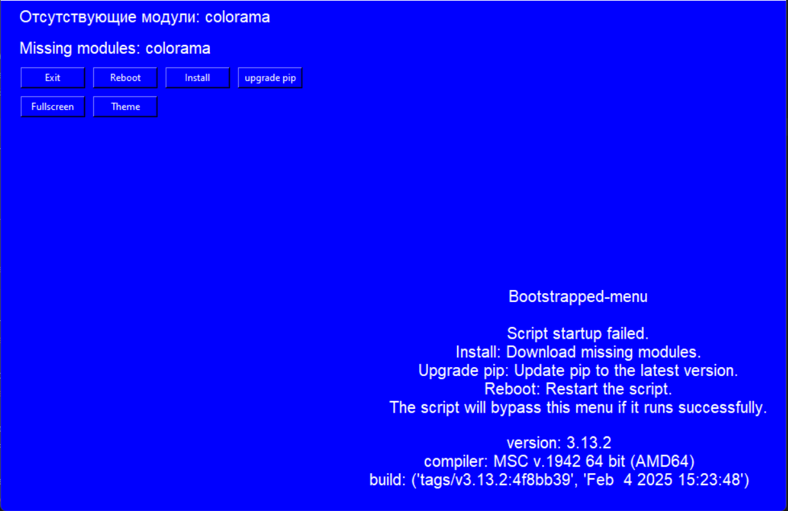
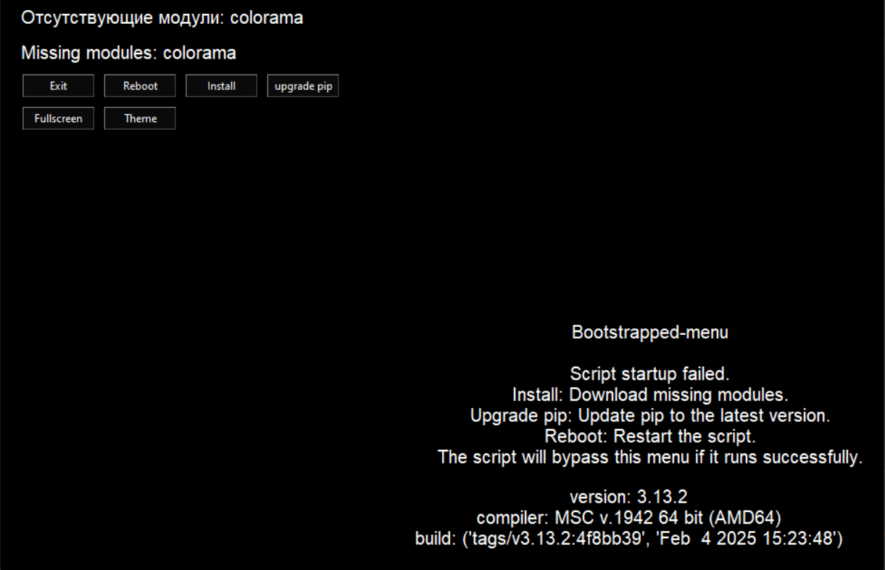
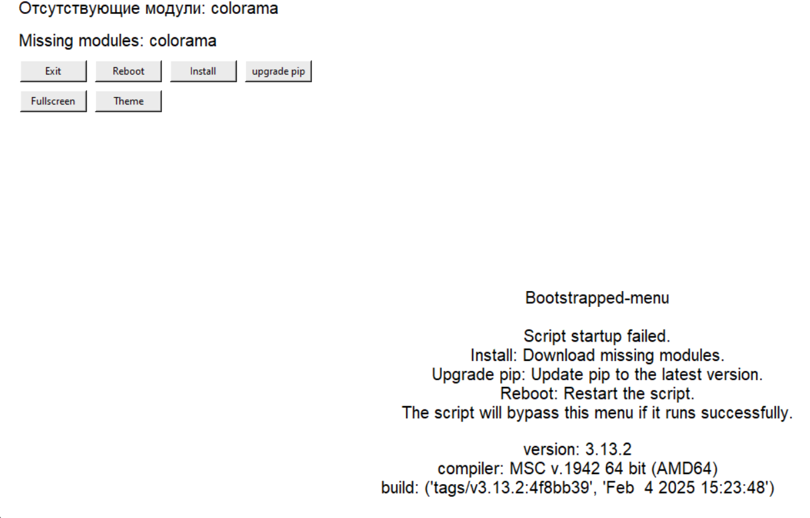

# BootsTrapper
## Смысл BootsTrapper в том, чтобы заменить ошибку ModuleNotFoundError

***
[Функции](#функции) | [Как использовать?](#как-использовать) | [Установка](#установка)
***
## Функции
1. **``Install`` - устанавливает недостающий модуль**
2. **``Upgrade pip`` - обновляет pip до последней версии**
3. **``Fullscreen`` - вкл/выкл полноэкранный режим**
4. **``Exit`` - выход**
5. **``Reboot`` - перезагружает скрипт, полезно после установки недостающего модуля**
6. **``Theme`` - Меняет тему на ``White``, ``Black``, ``Blue``**





***
## Как использовать
**В самом коде я написал много комментариев которые описывают что делает и для чего нужна та или инная функция**

**Минимальный пример:**


**Тут показан блок с кодом, который нужен для проверки и запуска вашего скрипта.**  
**Вам нужно в ``try`` написать все импортируемые модули которые нужно устанавливать через pip и/или ваши модули.**  
**Затем вы можете использовать этот скрипт как ``prepare`` для вашего ``main``, в основной скрипт при импорте модулей если пользователь словит ошибку ``ModuleNotFoundError``**  
**то в ``except`` вы можете поместить следующую команду:**

```python
boot_path = "boot_loader.py"
subprocess.Popen(["cmd", "/c" , sys.executable, str(boot_path)], creationflags=subprocess.CREATE_NEW_CONSOLE) 
#"/c" - чтобы консоль сама закрывалась при выходе. Изменить на /k чтобы консоль оставалась открытой
root.destroy() # желательно, если у вас tkinter/Ctkinter, чтобы main не запустился вместе с boottraper
sys.exit() # предохранитель для root.destroy, если у вас gui
```
**Теперь, будет запускаться бесконечная проверка: ``main -> error -> bootstrapper``, и ``bootstrapper -> if success -> main -> main scr``**
**Это нужно для того, чтобы запускать сразу ваш main-файл и не ждать проверки через bootstrapper, но если ваш main в начале поймает except то**  
**автоматически запустится bootstapper**

**В сборке присутствует example.py, который запускается когда bootstrapper не ловит ошибок в импорте. В самом example.py также есть проверка на установленные модули.**
***
## Установка
* **Скачать сборку**
* **Закинуть файл в свою сборку**
* **Следовать [указаниям](#как-использовать)**
* **После настройки можно запустить ``bootstrapper.py``**
***
**Links: [telegram](https://t.me/hidlow)**
**Tags: [В начало](#bootstrapper)**
